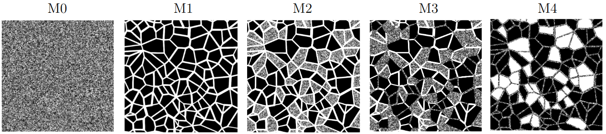
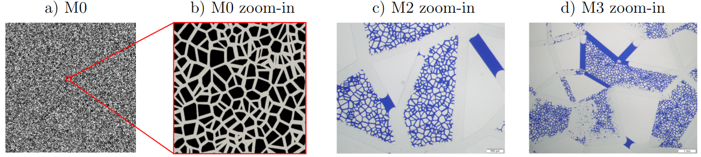
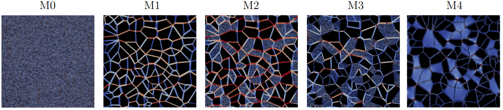

************************
Multiscale Micromodels
************************

In the field of porous media experimentation, recent advancements in micromodel manufacturing 
have enabled the creation of multiscale rock analogs. These analogs are characterized by the 
presence of micro and macro porosities. Thanks to its optical characteristics, micromodels 
facilitate a clear visualization of flow structures. These models offer two-dimensional 
approximations that effectively capture the behaviors and connectivity of pores present 
within the rock structure.

The micromodels M1, M2, M3 and M4 are simulated and compared with the experimental results of :cite:t:`wolf2022dual`
(https://doi.org/10.1039/D2LC00445C). Each of these micromodels has a square dimensions of :math:`25 \times 25~mm` and approximate 
depths of :math:`31(0.5)~\mu m`, :math:`34.8(0.9)~\mu m`, :math:`33.6(0.5)~\mu m`, and :math:`32.0(2.9)~\mu m` for models M1, M2, M3, and M4, 
respectively. :numref:`Figures %s <MX-Pore-Struc>` illustrate the micromodels structure. Additionally, the M0 micromodel is used 
to represent microporosity in the M2, M3, and M4 micromodels by overlapping the M1 and M0 micromodels in the specific 
micro-pore regions. {numref}`MX-P-Micro` illustrates the micro-porosity present in the micromodels M0, M2, and M3, using 
a zoomed-in images. Consequently, each micromodel is uniquely characterized by its pore structure described by:

- Micromodel 0 (M0): micro pore scale with pore diameter ranging from :math:`20` to :math:`50` :math:`\mu m`;

- Micromodel 1 (M1): macro pore scale with pore diameter ranging from :math:`200` to :math:`500` :math:`\mu m`;

- Micromodel 2 (M2): dual pore scale version of M1 with porous grains of pore diameter ranging from :math:`20` to :math:`50` :math:`\mu m`;

- Micromodel 3 (M3): dual pore scale version of M1 with porous grains and porous throats, both with pore diameter ranging from :math:`20` to :math:`50` :math:`\mu m`;

- Micromodel 4 (M4): dual pore scale version of M1 with voids and porous throats of pore diameter ranging from :math:`20` to :math:`50` :math:`\mu m`.

   Micromodels based on the Voronoi tessellation: M0 - micro pore scale; M1 - macro pore scale; M2 - dual pore scale version of M1 with porous grains;
   M3 - dual pore scale version of M1 with porous grains and porous throats; M4 - dual pore scale version of M1 with voids and porous throats.

   Micro-porosity based on the Voronoi tessellation: a) M0 micromodel; b) zoomed-in image showing the micro-porosity of the M0 structure; 
   c) zoomed-in image of the micro-porosity in the experimental micromodel M2; d) zoomed-in image of the micro-porosity in the experimental 
   micromodel M3. The experimental micromodel images c) and d) are saturated with two fluids.

-------------------------------------------
Absolute Permeability - Numerical Setup
-------------------------------------------

To simulate the micromodels depicted in :numref:`Figures %s <MX-Pore-Struc>`, the geometries are discretized into two grids as described in 
:numref:`Tab. %s <grid-micromodels>`. The first and last mesh points along the :math:`y` and :math:`z` axes are designated as solid, representing the walls 
of the micromodel. The fluid flows through the :math:`z`-axis promoted by an external force.

.. list-table:: Mesh specifications for the micromodels. The voxel size, grid dimensions, and digital porosity (:math:`\phi_{\mathrm{dig}}`) 
   are expressed in micrometers, number of voxels, and percentage, respectively. Mesh 2 has twice the grid resolution of Mesh 1.
   :header-rows: 1
   :align: center
   :name: grid-micromodels
   :widths: 10 35 35 20

   * 
      * **Model**
      * **Mesh 1** (Voxel size [:math:`\mu\mathrm{m}`] — Grid [:math:`x,y,z`])
      * **Mesh 2** (Voxel size [:math:`\mu\mathrm{m}`] — Grid [:math:`x,y,z`])
      * :math:`\boldsymbol{\phi_{\mathrm{dig}}}` **[%]**
   * 
      * M0
      * :math:`5.00 \;-\; 5000 \times 5002 \times 9`
      * :math:`2.50 \;-\; 10000 \times 10002 \times 16`
      * 46.1
   * 
      * M1
      * :math:`4.42 \;-\; 5646 \times 5648 \times 9`
      * :math:`2.21 \;-\; 11292 \times 11294 \times 16`
      * 27.3
   * 
      * M2
      * :math:`5.00 \;-\; 5000 \times 5002 \times 9`
      * :math:`2.50 \;-\; 10000 \times 10002 \times 16`
      * 40.2
   * 
      * M3
      * :math:`4.86 \;-\; 5148 \times 5150 \times 9`
      * :math:`2.43 \;-\; 10296 \times 10298 \times 16`
      * 33.6
   * 
      * M4
      * :math:`4.57 \;-\; 5468 \times 5470 \times 9`
      * :math:`2.28 \;-\; 10936 \times 10938 \times 16`
      * 36.7

A configurations example for the micromodel simulations is provided in ``.db`` below, using the M1 model with a grid size of 
:math:`5646 \times 5648 \times 9` as an example. The domain settings ``InletLayers = 0, 0, 5`` and ``OutletLayers = 0, 0, 5`` are used to 
connect the inlet and outlet of the periodic domain.

.. code-block:: c

   MRT {
      tau = 1.0
      F = 0.0, 0.0, 1.0e-6
      timestepMax = 60000
      tolerance = 0.00001
   }
   Domain {
      Filename = "M1-Micro-5646x5648x9.raw"
      ReadType = "8bit"      // data type
      N = 9, 5648, 5646     // size of original image
      nproc = 1, 2, 2        // process grid
      n = 9, 2824, 2823      // sub-domain size
      offset = 0, 0, 0 // offset to read sub-domain
      voxel_length = 4.42    // voxel length (in microns)
      ReadValues = 0, 1, 2   // labels within the original image
      WriteValues = 0, 1, 2  // associated labels to be used by LBPM
      InletLayers = 0, 0, 5 // specify 10 layers along the z-inlet
      OutletLayers = 0, 0, 5 // specify 10 layers along the z-inlet
      BC = 0                 // boundary condition type (0 for periodic)
   }
   Visualization {
      write_silo = true     // write SILO databases with assigned variables
      save_pressure = true    // save pressure field within SILO database
      save_velocity = true    // save velocity field within SILO database
   }

:numref:`Figure %s <MX-Pore_Res>` illustrates the velocity magnitude field obtained for each micromodel. 
:numref:`Tabela %s <Microodels-Perm-0>` analyzes and compares the obtained permeability values for each 
grid and with the experimental results of :cite:t:`wolf2022dual`.

   Velocity magnitude field obtained for each micromodel.

.. list-table:: Numerical and experimental comparisons of micromodel permeability. The numerical results obtained using the two meshes are compared with the experimental data reported by :cite:t:`wolf2022dual`. Permeability values are given in darcies (Da), and the discrepancies are expressed as percentages.
   :name: Microodels-Perm-0
   :header-rows: 2
   :align: center
   :widths: 10 15 15 20 20 20

   * 
      * **Model**
      * **Mesh 1**
      * **Mesh 2**
      * **Mesh discrepancy**
      * **Experimental** :cite:t:`wolf2022dual`
      * **Experimental discrepancy**
   * 
      *
      * :math:`k_1` [Da]
      * :math:`k_2` [Da]
      * :math:`\left|\frac{k_1-k_2}{k_2}\right| \times 100` [%]
      * :math:`k_{\mathrm{exp}}` [Da]
      * :math:`\left|\frac{k_2-k_{\mathrm{exp}}}{k_{\mathrm{exp}}}\right| \times 100` [%]
   * 
      * M0
      * 10.92
      * 10.06
      * 8.95
      * —
      * —
   * 
      * M1
      * 9.49
      * 8.88
      * 6.87
      * 8.91 (0.03)
      * 0.33
   * 
      * M2
      * 16.56
      * 15.42
      * 7.39
      * 13.24 (0.44)
      * 16.46
   * 
      * M3
      * 7.26
      * 6.52
      * 11.35
      * 5.74 (0.01)
      * 13.58
   * 
      * M4
      * 4.41
      * 3.75
      * 17.60
      * 5.71 (1.25)
      * 34.32

The numerically obtained permeability values for the micromodels M1, M2, and M3 show good agreement with the 
experimental values reported by :cite:t:`wolf2022dual`. In these cases, the grid convergence test exhibits a 
trend towards approximating the experimental values. However, for the M4 model, there is a divergence from the 
experimental values as the grid size increases.