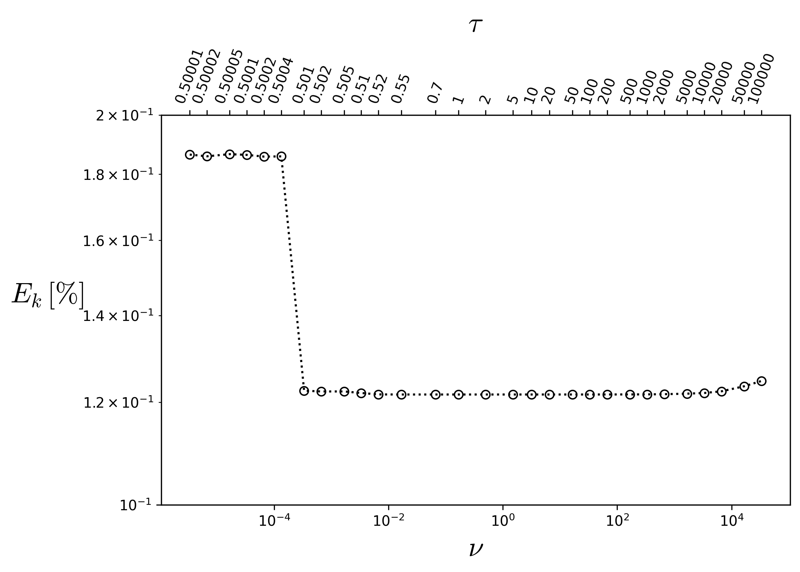

************************
Body-Centered Cubic
************************

This analysis considers a benchmark case commonly used to validate software tools for simulating 
fluid flow through porous media in the Darcy regime, as an analytical solution for the permeability 
of the three-dimensional domain is available. Additionally, this benchmark can be used to assess 
whether the dependence of the absolute permeability (:math:`k`) on the fluid viscosity, represented 
by the relaxation time of the collision model (:math:`\tau`), is properly mitigated. This dependence 
is well known in the lattice Boltzmann literature, and approaches to reduce its effects have been 
demonstrated by :cite:t:`pan2006`. It should be noted that the relationship between permeability 
and relaxation time is directly influenced by both the collision model and the boundary conditions 
employed in the simulation.

Therefore, the problem of creeping flow through a periodic body-centered cubic (BCC) array is investigated, and the
present results are compared with those reported by :cite:t:`pan2006`. The geometry consists of an array of spheres 
with radius :math:`R = 11~lu` arranged in a cubic domain with side length :math:`L = 32~lu` (where :math:`lu` denotes 
lattice units), as illustrated in :numref:`Fig. %s <bcc-bench>` and :numref:`Fig. %s <bcc-plane>`.

.. list-table::
   :widths: 50 50
   :align: center

   * - .. figure:: ../../../_static/images/bcc-bench.png
          :width: 50%
          :align: center
          :name: bcc-bench

          3D domain of :math:`32^{3}` lattices obtained for :math:`R=11~lu`

     - .. figure:: ../../../_static/images/bcc-plane.png
          :width: 40%
          :align: center
          :name: bcc-plane

          2D schematic projection

**Generatinf BCC Domain:** The python to generate the 3D domain employd in the present analysis is given in toggle below:

.. raw:: html

   

   
<strong>Click here to open: Domain Code</strong>

.. code-block:: python

   #Numerical Domain Size
   Nx=32
   Ny=Nx
   Nz=Nx

   solid=np.ones((Nx,Ny,Nz),dtype="uint8") # Binary array to allocate the mapp of pore and solid
   # ------------------------ Setting Body Cubic Centered Geometry --------------------------------
   Rr = 11.0*1.0 #Sphere Radio
   for i in range(0,Nx):
      for j in range (0, Ny):
         for l in range (0,Nz):
               dist = np.sqrt((i+0.5-Nx/2)*(i+0.5-Nx/2) + (j+0.5-Ny/2)*(j+0.5-Ny/2) + (l+0.5-Nz/2)*(l+0.5-Nz/2))
               if (dist < Rr) :
                  solid[i,j,l] = 0
               dist = np.sqrt((i+0.5-Nx)*(i+0.5-Nx) + (j+0.5)*(j+0.5) + (l+0.5)*(l+0.5))
               if (dist < Rr) :
                  solid[i,j,l] = 0
               dist = np.sqrt((i+0.5)*(i+0.5) + (j+0.5-Ny)*(j+0.5-Ny) + (l+0.5)*(l+0.5))
               if (dist < Rr) :
                  solid[i,j,l] = 0
               dist = np.sqrt((i+0.5)*(i+0.5) + (j+0.5)*(j+0.5) + (l+0.5-Nz)*(l+0.5-Nz))
               if (dist < Rr) :
                  solid[i,j,l] = 0
               dist = np.sqrt((i+0.5)*(i+0.5) + (j+0.5)*(j+0.5) + (l+0.5)*(l+0.5))
               if (dist < Rr) :
                  solid[i,j,l] = 0
               dist = np.sqrt((i+0.5)*(i+0.5) + (j+0.5-Ny)*(j+0.5-Ny) + (l+0.5-Nz)*(l+0.5-Nz))
               if (dist < Rr) :
                  solid[i,j,l] = 0
               dist = np.sqrt((i+0.5-Nx)*(i+0.5-Nx) + (j+0.5)*(j+0.5) + (l+0.5-Nz)*(l+0.5-Nz))
               if (dist < Rr) :
                  solid[i,j,l] = 0
               dist = np.sqrt((i+0.5-Nx)*(i+0.5-Nx) + (j+0.5-Ny)*(j+0.5-Ny) + (l+0.5)*(l+0.5))
               if (dist < Rr) :
                  solid[i,j,l] = 0
               dist = np.sqrt((i+0.5-Nx)*(i+0.5-Nx) + (j+0.5-Ny)*(j+0.5-Ny) + (l+0.5-Nz)*(l+0.5-Nz))
               if (dist < Rr) :
                  solid[i,j,l] = 0

   solid.tofile("bcc-%d.raw"% (Ny)) # Array save in a file .raw 

.. raw:: html

   

.. raw:: html

    

Following the procedure presented by :cite:t:`sangani1982slow`, the analytical solution for the absolute permeability (:math:`k`) of a BCC array is given by

.. math::
	
	k^{*}=\displaystyle\frac{1}{6\pi a^{*} d^{*}},

where :math:`k^{*}=k/(2a)^{2}` is the dimensionless absolute permeability, :math:`a` is the sphere radius, :math:`a^{*}=a/L` is the normalized sphere radius, 
:math:`L` is the cube side length, and :math:`d^{*}` is the dimensionless drag force defined as:

.. math::

	d^{*}=\displaystyle\frac{6\pi a^{*} \rho \nu }{F_{D}},

being :math:`\rho` the fluid density, :math:`\nu` the kinematic viscosity, :math:`F_{D}` the drag force. The dimensionless drag force used in the present 
analytical solution is obtained by the geometric propertie of solid volume fraction :math:`c` as a power-series expansion given by

.. math::

	d^{*}=\displaystyle\sum_{n=0}^{30}\alpha_{n}\chi^{n}, \quad\quad 
	\chi=\left(\displaystyle\frac{c}{c_{max}}\right)^{1/3}, \quad\quad c=\displaystyle\frac{8\pi a^{3}}{3L^{3}}, 
	\quad\quad c_{\max}=\displaystyle\frac{\sqrt{3}\pi}{8},

where :math:`\chi` the relation between the solid volume and maximum solid volume, and :math:`\alpha_{n}` the coefficients. The toggle below provides a 
Python code to calculate the analytical solution using the power-series expansion up to the 25th order.

.. raw:: html

   

   
<strong>Click here to open: BCC analytical absolute permeability</strong>

.. code-block:: python

   import numpy as np
   import matplotlib.pyplot as plt

   #Coefficients up to the order 25
   alpha_s = np.array([1.0,1.575834,2.483254,3.233022,4.022864,4.650320,5.281412,
                     5.826374,6.258376,6.544504,6.878396,7.190839,7.268068,
                     7.304025,7.301217,7.2364410,7.298014,7.369847,7.109497,
                     6.228418,5.235796,4.476874,3.541982,2.939353,3.935484])
   a=11.0          # Sphere Radius
   L=32.0          # Cubic Domain Length
   a_s=a/L         # Dimensionless Ratio
   chi=( (64.0*a_s**(3.))/(np.sqrt(3.0)*3.0*(1.0)**(3.0)) )**(1./3.) #Ratio between solid volume and max volume of solid
   #-------------Dimensionless Drag Force Calculation-----------------------------
   d=0.0
   for i in range (0,len(alpha_s)):
      d=d+alpha_s[i]*chi**(i)
   #-------------------------------------------------------------------------------
   kana=1.0/(d*6.0*np.pi*a_s) #Dimensionless Permeability
   print("--------------------------------------------------------------------------------")
   print("d=",d, "        Dimensionless Drag Force")
   print("k=",kana, "     Dimensionless Permeability")
   print("chi=",chi, "     Ratio between solid volume and max volume of solid")

.. raw:: html

   

.. raw:: html

    

------------------------------
Results
------------------------------

~~~~~~~~~~~~~~~~~~~~~~~~~
Example for ``BC = 0``
~~~~~~~~~~~~~~~~~~~~~~~~~

Fluid-flow simulations through the BCC medium are performed by varying the relaxation time (``tau``) and, consequently, the 
fluid kinematic viscosity (:math:`\nu`), in order to analyze the viscosity dependence of the absolute permeability and assess 
the stability range of the simulations. In the present case, fully periodic boundary conditions are applied in all directions, 
and the pressure gradient is imposed through an external body force. The ``.db`` input file used to simulate the present case 
is presented below. Note that the pressure gradient (:math:`\Delta p/L`) is imposed along the :math:`z`-direction and kept constant at :math:`10^{-5}`
for all cases considered in the present analysis. If excessively large pressure gradients are imposed, the fluid flow may leave the Darcy regime, 
leading to a deviation from the linear relationship between pressure gradient and flow rate due to the increasing influence of inertial effects.

.. code-block:: c

   MRT {
      tau = 1.0
      F = 0.0, 0.0, 1.0e-5
      timestepMax = 10000
      tolerance = 0.000001
   }
   Domain {
      Filename = "bcc-32.raw"
      ReadType = "8bit"      // data type
      N = 32, 32, 32         // size of original image
      nproc = 1, 1, 1        // process grid
      n = 32, 32, 32         // sub-domain size
      offset = 0, 0, 0       // offset to read sub-domain
      voxel_length = 1.00    // voxel length (in microns)
      ReadValues = 0, 1, 2   // labels within the original image
      WriteValues = 0, 1, 2  // associated labels to be used by LBPM
      BC = 0                 // boundary condition type (0 for fully periodic)
   }
   Visualization {
      write_silo = true     // write SILO databases with assigned variables
      save_phase_field = true  // save phase field within SILO database
      save_pressure = true    // save pressure field within SILO database
      save_velocity = true    // save velocity field within SILO database
   }

The obtained LBPM results are compared with those obtained by :cite:t:`pan2006` for the MRT and BGK collision models using 
half-way bounce-back (HWBB) boundary condition for non-slip surfaces as illustrated in the :numref:`Fig. %s <bcc-perm>`. Notice good accuracy as well as constante values
of the normalized absolute permeability (:math:`k^{*}_{num}/k^{*}_{ana}`) as a function of fluid kinematic viscosity (:math:`\nu`), 
variating ``tau`` from 0.6 up to 2. In :numref:`Fig. %s <bcc-range>`, the kinematic viscosity is varied over a wider range to assess the numerical stability of the method. 
Additionally, the percentage error (:math:`E_k[\%]=|1-k^{*}_{num}/k^{*}_{ana}|\times 100`) remains nearly constant at approximately :math:`0.12~\%`. This result 
indicates that the computed permeability is essentially independent of the fluid viscosity over the investigated range. The code and data used to generate the plots 
are provided in the toggle sections below.

.. list-table::
   :widths: 50 50
   :align: center

   * - .. figure:: ../../../_static/images/bcc-perm.png
          :width: 70%
          :align: center
          :name: bcc-perm

          Comparison of the :math:`k^{*}_{num}/k^{*}_{ana}` as function of :math:`\nu`. The superscript :math:`*` indicate the results reported by :cite:t:`pan2006`.

     - .. figure:: ../../../_static/images/bcc-stable-range.png
          :width: 70%
          :align: center
          :name: bcc-range

          Percentage error as a function of viscosity and, consequently, of the relaxation time.

.. raw:: html

   

   
<strong>Click here to open: Plot and Data</strong>

.. code-block:: python

   import numpy as np
   import matplotlib.pyplot as plt
   plt.rcParams['mathtext.fontset'] = 'cm'

   #----------------------------------------------------------
   a=11.0 # Sphere Radius
   tau = np.array([2,1.5,1,0.8,0.6])  # Relaxation Time Values
   nu=(tau-0.5)/3.0                   # Kinematic Viscosity Calculation
   mDa_scal=1013                      #K miliDarcy Scaling Parameter 
   knum = np.array([4716.5277,4716.527601,4716.525403,4716.509253,4715.013061]) #Output absolute Permeability from LBPM
   kMRT_Pan = np.array([0.984,0.984,0.984,0.984,0.984]) #MRT-HWBB
   kBGK_Pan = np.array([1.235,1.113,0.999,0.940,0.886]) #BGK-HWBB
   #------------------Plots--------------------------------------
   plt.plot(nu,(knum/(4.0*a*a*mDa_scal))/kana,'ko:',fillstyle='none')
   plt.plot(nu,kMRT_Pan,'r:s',fillstyle='none')
   plt.plot(nu,kBGK_Pan,'b:v',fillstyle='none')
   plt.plot(nu,knum*0+1,'k--',fillstyle='none')
   plt.ylabel('$\\frac{k^{*}_{num}}{k^{*}_{ana}}$', color='k', horizontalalignment='right',rotation=0, fontsize=20)
   plt.xlabel('$\\nu$', fontsize=20)
   plt.legend(['LBPM','MRT-HWBB*','BGK-HWBB*','Analytical'],fontsize=11.,bbox_to_anchor=(1.0, 1.02))
   plt.show()

.. raw:: html

   

.. raw:: html

    

.. raw:: html

   

   
<strong>Click here to open: Plot and Data</strong>

.. code-block:: python

   import numpy as np
   import matplotlib.pyplot as plt
   plt.rcParams['mathtext.fontset'] = 'cm'

   tau = np.array([0.51, 0.52, 0.55, 0.7, 1, 2, 5, 10, 20,50, 100, 200, 500, 1000, 2000, 5000,10000, 20000])
   knum = np.array([4716.512334, 4716.526762, 4716.527702, 4716.527727,4716.527726, 4716.527724, 4716.527720, 4716.527711,
      4716.527694, 4716.527642, 4716.527560, 4716.527388,4716.526898, 4716.526340, 4716.524416, 4716.518975,4716.512262, 4716.494803])

   #----------------------------------------------------------
   a=11.0 # Sphere Radius
   nu=(tau-0.5)/3.0                   # Kinematic Viscosity Calculation
   mDa_scal=1013                      #K miliDarcy Scaling Parameter
   kana  = 0.009631551395713422
   #------------------Plots--------------------------------------
   fig, ax = plt.subplots(figsize=(8, 5))
   ax.loglog(nu,(1.0-(knum/(4.0*a**2*mDa_scal))/kana)*100 ,'ko:',fillstyle='none')
   ax.set_xlabel(r'$\nu$', fontsize=20)
   ax.set_ylabel(r'$E_k\,[\%]$',fontsize=20,rotation=0,labelpad=25)
   ax.set_ylim(0.1, 0.2)
   # Create upper x-axis
   ax_top = ax.twiny()
   ax_top.set_xscale('log')
   ax_top.set_xlim(ax.get_xlim())
   ax_top.set_xticks(nu)
   ax_top.set_xticklabels(['0.51', '0.52', '0.55', '0.7', '1', '2', '5','10', '20', '50', '100', '200', '500', '1000', '2000', '5000', '10000','20000'])
   ax_top.set_xlabel(r'$\tau$', fontsize=20, labelpad=10)
   ax_top.tick_params(axis='x', labelsize=10, rotation=45)
   plt.savefig('bcc-stable-range.png',dpi=300,bbox_inches='tight')
   plt.show()

.. raw:: html

   

.. raw:: html

    

However, extending the analysis presented in :numref:`Fig. %s <bcc-range>` to a more extreme range of viscosity values, :numref:`Fig. %s <bcc-range-2>` shows a deviation 
from the approximately constant permeability error observed over the intermediate range. At these limiting viscosity values, the finite precision of floating-point 
arithmetic becomes increasingly relevant, introducing round-off errors that may affect the numerical accuracy of the computed quantities and, consequently, 
the convergence behavior of the numerical method. For each viscosity value, the imposed pressure difference must be adjusted to ensure that the fluid flow remains 
within the Darcy regime. The code and data used to generate the plots are provided in the toggle sections below.

   Wide range analysis of percentage error as a function of viscosity.

.. raw:: html

   

   
<strong>Click here to open: Plot and Data</strong>

.. code-block:: python

   import numpy as np
   import matplotlib.pyplot as plt
   plt.rcParams['mathtext.fontset'] = 'cm'

   tau = np.array([0.50001,0.50002,0.50005,0.5001,0.5002,0.5004,0.501,0.502,0.505,0.51,0.52,0.55,0.7,1,2,5,10,20,50,100,200,500,1000,2000,5000,10000,20000,50000,100000,])

   knum = np.array([4713.470653,4713.497491,4713.464046,4713.475326,4713.502245,4713.498671,4716.488713,4716.496416,4716.496424,
                  4716.512334,4716.526762,4716.527702,4716.527727,4716.527726,4716.527724,4716.52772,4716.527711,4716.527694,4716.527642,4716.52756,4716.527388,
                  4716.526898,4716.52634,4716.524416,4716.518975,4716.512262,4716.494803,4716.442745,4716.387791,])

   #----------------------------------------------------------
   a=11.0 # Sphere Radius
   nu=(tau-0.5)/3.0                   # Kinematic Viscosity Calculation
   mDa_scal=1013                      #K miliDarcy Scaling Parameter
   kana  = 0.009631551395713422
   #------------------Plots--------------------------------------
   fig, ax = plt.subplots(figsize=(8, 5))
   ax.loglog(nu,(1.0-(knum/(4.0*a**2*mDa_scal))/kana)*100 ,'ko:',fillstyle='none')
   ax.set_xlabel(r'$\nu$', fontsize=20)
   ax.set_ylabel(r'$E_k\,[\%]$',fontsize=20,rotation=0,labelpad=25)
   ax.set_ylim(0.1, 0.2)
   # Create upper x-axis
   ax_top = ax.twiny()
   ax_top.set_xscale('log')
   ax_top.set_xlim(ax.get_xlim())
   ax_top.set_xticks(nu)

   ax_top.set_xticklabels([f"{T:g}" for T in tau])
   ax_top.set_xlabel(r'$\tau$', fontsize=20, labelpad=10)
   ax_top.tick_params(axis='x', labelsize=10, rotation=70)
   plt.savefig('bcc-stable-range-2.png',dpi=300,bbox_inches='tight')
   plt.show()

.. raw:: html

   

.. raw:: html

    