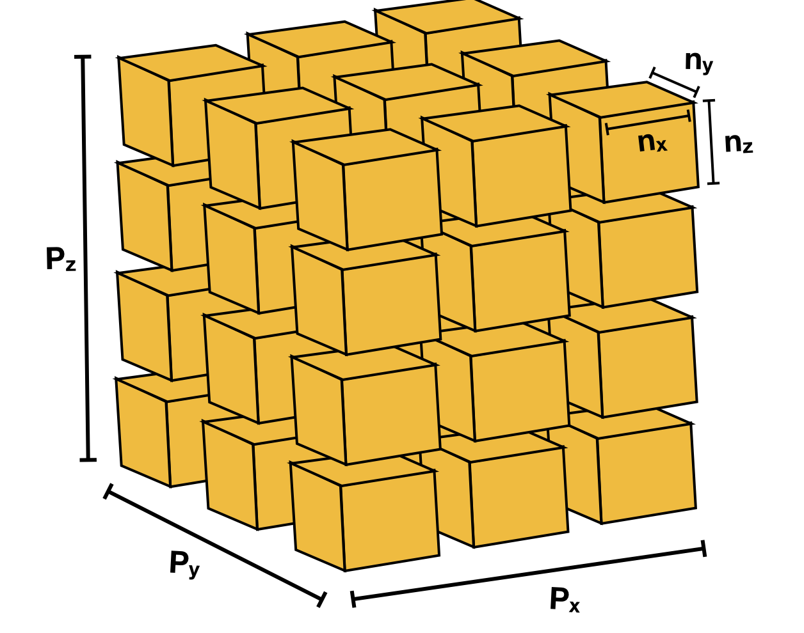

###############################################################################
Domain Decomposition (lbpm_serial_decomp)
###############################################################################

In order to perform simulations using large digital rock images, it is typically necessary to 
break the volumetric image into sub-regions so that different processing elements can operate 
on the data in parallel. This procedure is known as domain decomposition. In LBPM, the domain 
decomposition is performed using a regular process grid such that each processing element is 
assigned an equally-sized sub-region of the original image. The volumetric image will thus be 
sub-divided in a fashion analogous to the image depicted below

Information regarding the intended domain structure and domain decomposition must be provided to LBPM from an input file. Input 
files are available from several of the examples contained in the ``example/`` directory, e.g. given the name ``input.db``. LBPM 
relies on a input database structure to provide key information, which are separated by category. The ``Domain`` category is used 
to specify information about domain structure, and is required for most tools within LBPM. However, all fields of the input 
database are not required for all simulation tools. An example of how the ``Domain`` category of an input database for the Bentheimer rock

.. code-block:: text

   Domain {
      Filename = "mask_water_flooded_water_and_oil.raw"
      ReadType = "16bit"  // data type
      N = 601, 594, 1311  // size of original image
      nproc = 2, 2, 2     // process grid
      n = 300, 297, 300   // sub-domain size
      voxel_length = 7.0  // voxel length (in microns)
      ReadValues = 0, 1, 2  // labels within the original image
      WriteValues = 0, 2, 1 // associated labels to be used by LBPM
      BC = 0                // boundary condition type (0 for periodic)
   }

**Note spacing -- spaces should separate assigned variables from** ``=`` **and after** ``,``
 
The ``Domain`` section is the only required category that is needed to perform domain decomposition.
Other categories in the database provide model-specific information (as will be discussed in subsequent 
tutorials). If category is not needed by a particular model, it will be ignored. 

In order to perform a domain decomposition, it is imperative that the user provide the following fields:

1. ``Filename`` -- where to read the input image
2. ``N = 601, 594, 1311`` -- the size of the input image
3. ``nproc = 2, 2, 2`` -- the number of sub-regions in the process grid in each direction
4. ``n = 300, 297, 300`` -- the dimensions of the sub-domain
5. ``ReadValues`` -- list of labels in the original image
6. ``WriteValues`` -- list of labels to be used by LBPM

Since it is not possible to perform domain decomposition without this information, the executable will 
throw an exception and fail if these fields are not populated. Other fields are optional, but it is a 
good idea to also provide:

* ``ReadType`` (default value assigned to ``"8bit"``)
* ``voxel_length`` (default value assigned to ``1.0``)

The size of the simulation domain will not automatically match with the original size of the input 
image. This is because the simulation domain size is determined from the process grid. In the example 
above, the total size of the simulated domain will be ``600, 594, 600``. This means that the code will 
operate on a sub-region of the original image. 

Once the information input database has been populated the domain decomposition procedure can be 
performed internally by LBPM simulators. In some situations it may be useful to run the domain decomposition 
separately, for example to verify that the decomposition is being performed in the expected way. It 
can be performed in advance using the tool ``lbpm_serial_decomp``, which is launched as follows:

.. code-block:: text

   mpirun -n 1 lbpm_serial_decomp input.db

where ``input.db`` is the input file. Unlike other simulation tools within LBPM, only one MPI process is 
needed to launch domain decomposition. In most situations there is no compelling advantage to performing 
domain decomposition in parallel. Successful application should produce the following output:

.. code-block:: text

   Input media: mask_water_flooded_water_and_oil.raw
   Relabeling 3 values
   oldvalue=0, newvalue =0 
   oldvalue=1, newvalue =2 
   oldvalue=2, newvalue =1 
   Dimensions of segmented image: 601 x 594 x 1311 
   Reading 16-bit input data 
   Read segmented data from mask_water_flooded_water_and_oil.raw 
   Distributing subdomains across 8 processors 
   Process grid: 2 x 2 x 2 
   Subdomain size: 300 x 297 x 300 
   Size of transition region: 0 
   Label=0, Count=188477277 
   Label=1, Count=16753091 
   Label=2, Count=12929600 

