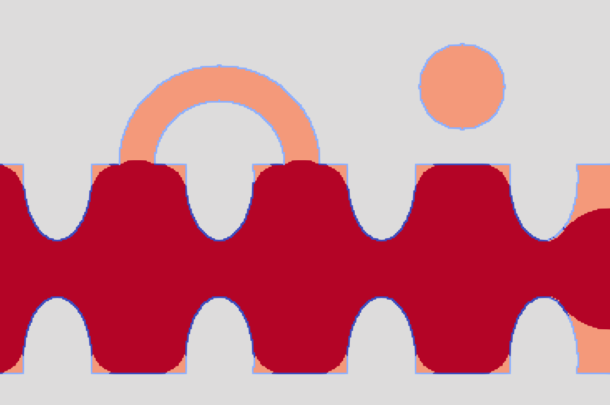

*****************************
Digital drainage
*****************************

LBPM includes a routine to perform digital drainage experiments through the Full Morphology method. The ``ylm-inc`` algorithm performs non-wetting fluid intrusion by introducing spheres with progressively decreasing radius in the porous media.

The invaded fluid connection to the inlet face is checked to simulate the invasion as it happens on the physical experiment. At the same time, the expelled fluid is considered incompressible, so there is a residual saturation left at the end of the process.

At each diameter, the routine identifies the fluid voxels in contact to the solid matrix to perform a digital aging. These interface voxels are saved with different labels and this labem map can be exported to other routines such as ``lbpm_color_simulator`` to set different wettabilities.

Input
-----

The input file format is given by 

.. code:: c

	  Domain {
		Filename = "example.raw"
		N = 100, 100, 100            // domain size
		VoxelLabels = 0, 1, 2, 3     // solid, vacuum, injected, pore (PORE NÃO FAZ SENTIDO)
		}

	  YLM {
		Diameters = 2, 50, 1         // smallest, biggest, step
		ImageRoot = "img"            // name files
		ImageDir = "folder"          // folder in which data is saved
		WhichImage = "all"           // which image to save: all, last, none
		Direction = 0, 0, 1          // axis of intrusion (accepts negative values)
		}

Once this has been set, ``ylm-inc`` routine is launched via

.. code:: bash

	  mpirun -np 1 $LBPM_DIR/tests/ylm-inc input.db

Note that this routine does not run in parallel computation.

Output
------

The expected output is a folder which contains the ``.raw`` files specified on the input file, and a ``.dat`` file which gives information about the saturations versus diameter points:

.. code:: bash

	# ##################################################################
    # Arquivo criado com o comando:  /home/bernardo.gehlen/zabot/build2/ylm 4 ./config40-1.cfg 
    # No diretorio:  /home/bernardo.gehlen/bentheimer1600/ylm-results/stat-inc
    # Em:  15:32:09  Jun 13 2025
    #
    #   * Image width  (x) (px)     : 555
    #   * Image height (y) (px)     : 555
    #   * Image planes (z) (px)     : 987
    #   * Number of porous pixels   : 68976436
    #
    # Coluna  1: Step
    # Coluna  2: Diameter (px)
    # Coluna  3: Number of pixels occupied by inlet fluid.
    # Coluna  4: Number of pixels occupied by inlet fluid / Number of porous pixels
    # Coluna  5: Number of pixels occupied by outlet fluid.
    # Coluna  6: Number of pixels occupied by outlet fluid  / Number of porous pixels
    # ##################################################################
    0 50 212364 0.00307879 68764072 0.996921
    1 49 215917 0.0031303 68760519 0.99687
    2 48 221605 0.00321276 68754831 0.996787
    3 47 226588 0.00328501 68749848 0.996715
    4 46 234476 0.00339936 68741960 0.996601
    5 45 243315 0.00352751 68733121 0.996472
    6 44 252077 0.00365454 68724359 0.996345
    7 43 259305 0.00375933 68717131 0.996241
    8 42 1833473 0.0265812 67142963 0.973419
    9 41 1871125 0.027127 67105311 0.972873
    10 40 1909781 0.0276874 67066655 0.972313
    11 39 1939199 0.0281139 67037237 0.971886
    12 38 1983019 0.0287492 66993417 0.971251
    13 37 2007757 0.0291079 66968679 0.970892
    14 36 2047387 0.0296824 66929049 0.970318
    15 35 2067882 0.0299795 66908554 0.97002
    16 34 2098069 0.0304172 66878367 0.969583
    17 33 2162340 0.031349 66814096 0.968651
    18 32 2215249 0.032116 66761187 0.967884
    19 31 2286474 0.0331486 66689962 0.966851
    20 30 6270383 0.0909062 62706053 0.909094
    21 29 6390763 0.0926514 62585673 0.907349
    22 28 6615930 0.0959158 62360506 0.904084
    23 27 6908625 0.100159 62067811 0.899841
    24 26 7128589 0.103348 61847847 0.896652
    25 25 7252013 0.105138 61724423 0.894862
    26 24 7540882 0.109325 61435554 0.890675
    27 23 7732966 0.11211 61243470 0.88789
    28 22 8071233 0.117014 60905203 0.882986
    29 21 8215388 0.119104 60761048 0.880896
    30 20 11056183 0.160289 57920253 0.839711
    31 19 11347104 0.164507 57629332 0.835493
    32 18 13725341 0.198986 55251095 0.801014
    33 17 14826146 0.214945 54150290 0.785055
    34 16 15676837 0.227278 53299599 0.772722
    35 15 16861145 0.244448 52115291 0.755552
    36 14 18151732 0.263158 50824704 0.736842
    37 13 45847019 0.664677 23129417 0.335323
    38 12 51307983 0.743848 17668453 0.256152
    39 11 54389114 0.788517 14587322 0.211483
    40 10 57246455 0.829942 11729981 0.170058
    41 9 58603786 0.84962 10372650 0.15038
    42 8 59434281 0.861661 9542155 0.138339
    43 7 59480955 0.862337 9495481 0.137663
    44 6 59525826 0.862988 9450610 0.137012
    45 5 59543127 0.863239 9433309 0.136761
    46 4 59555053 0.863412 9421383 0.136588
    47 3 59555695 0.863421 9420741 0.136579
    48 2 59566289 0.863574 9410147 0.136426
    49 1 59566289 0.863574 9410147 0.136426

Benchmark
-----------

A pore-throat geometry is used to demonstrate the final state of the simulation. The output ``.raw`` file contains the final fluid distribution with the following voxel labels:

* 0 (green): Solid matrix
* 1 (orange): Displaced fluid that remains trapped (residual saturation)
* 2 (red): injected fluid that forms the main connected path.

In addition, the digital aging analysis generates a map of the fluid-solid interfaces. The voxels at this interface are labeled as:

* -1 (blue): Interface between the displaced fluid and the solid
* -2 (white): Interaface between the injected fluid and the solid

Final ``.raw`` image given by the routine for a benchmark. Different shades of blue are different labels and may be used to set wettabilities.

Image given by ``lbpm_color_simulator`` with Ca =  5e-4.
