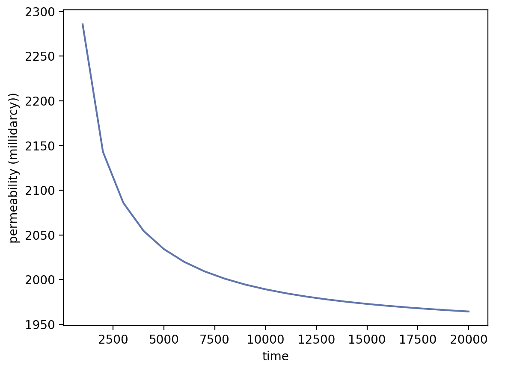

###############################################################################
Single-Phase Pore-Scale Model (lbpm_permeability_simulator)
###############################################################################

The LBPM single fluid model is implemented by a multi-relaxation time (MRT) collision model in a D3Q19
lattice representation of lattice Boltzmann equation (LBE) to solve the fluid momentum transport, recovering the Navier-Stokes
equations. Beside the MRT scheme a set two-relaxation time (TRT) is used to avoid half-way bounce-back slip effects :cite:p:`pan2006`. The implemented 
modeling is used to assess the permeability of digital rock images in either the Darcy or non-Darcy flow regimes. 

****************************
LBM Formulation
****************************

.. raw:: html

   <details>
   <summary><strong>Click here to open: LBM Formulation</strong></summary>

The LBE governing momentum transport is defined based on a MRT scheme based on the D3Q19 discrete
velocity set:

.. math::
   :nowrap:

   $$
      f_q(\boldsymbol{x}_i + \boldsymbol{\xi}_q \delta t,t + \delta t) - f_q(\boldsymbol{x}_i,t) = \sum^{Q-1}_{k=0} M^{-1}_{qk} \lambda_{k} (m_k^{eq}-m_k) + w_q \boldsymbol{\xi}_q \cdot \frac{\boldsymbol{F}}{c_s^2} \;,
   $$

where :math:`\boldsymbol{F}` is an external body force, :math:`c_s^2 = 1/3` is the speed of sound and :math:`\boldsymbol{\xi}_q` are the unit lattice vectors for the Lattice discretization:

.. math::
   :nowrap:

   $$
      \boldsymbol{\xi}_q=\xi_{q,\alpha} =\left\{
      \begin{array}{llll}
         \alpha=0, & \{0,0,0\}, & \text{for } q = 0, & w_{0}=1/3 \\[4pt]
         \alpha=x, & \{\pm 1,0,0\}, & \text{for } q = 1,2, & w_{1,2}=1/18 \\[4pt]
         \alpha=y, & \{0,\pm 1,0\}, & \text{for } q = 3,4, & w_{3,4}=1/18 \\[4pt]
         \alpha=z, & \{0,0,\pm 1\}, & \text{for } q = 5,6, & w_{5,6}=1/18 \\[4pt]
         \alpha=x,y,& \{\pm 1,\pm 1,0\}, & \text{for } q = 7,8,9,10, & w_{7,8,9,10}=1/36 \\[4pt]
         \alpha=x,z,& \{\pm 1,0,\pm 1\}, & \text{for } q = 11,12,13,14, & w_{11,12,13,14}=1/36 \\[4pt]
         \alpha=y,z,& \{0,\pm 1,\pm 1\}, & \text{for } q = 15,16,17,18, & w_{15,16,17,18}=1/36 .
      \end{array}\right.
   $$


The moments defined in the Gram--Schmidt basis are linearly independent functions of the distribution functions:

.. math::
   :nowrap:

   $$
      m_k = \sum_{q=0}^{18} M_{qk} f_q\; \qquad \rightarrow \qquad M_{qk} = \left(
      \begin{array}{rrrrrrrrrrrrrrrrrrr}
      1 & 1 & 1 & 1 & 1 & 1 & 1 & 1 & 1 & 1 & 1 & 1 & 1 & 1 & 1 & 1 & 1 & 1 & 1 \\
      -30 & -11 & -11 & -11 & -11 & -11 & -11 & 8 & 8 & 8 & 8 & 8 & 8 & 8 & 8 & 8 & 8 & 8 & 8 \\
      12 & -4 & -4 & -4 & -4 & -4 & -4 & 1 & 1 & 1 & 1 & 1 & 1 & 1 & 1 & 1 & 1 & 1 & 1 \\
      0 & 1 & -1 & 0 & 0 & 0 & 0 & 1 & -1 & 1 & -1 & 0 & 0 & 1 & -1 & 1 & -1 & 0 & 0 \\
      0 & -4 & 4 & 0 & 0 & 0 & 0 & 1 & -1 & 1 & -1 & 0 & 0 & 1 & -1 & 1 & -1 & 0 & 0 \\
      0 & 0 & 0 & 1 & -1 & 0 & 0 & 1 & -1 & 0 & 0 & 1 & -1 & -1 & 1 & 0 & 0 & 1 & -1 \\
      0 & 0 & 0 & -4 & 4 & 0 & 0 & 1 & -1 & 0 & 0 & 1 & -1 & -1 & 1 & 0 & 0 & 1 & -1 \\
      0 & 0 & 0 & 0 & 0 & 1 & -1 & 0 & 0 & 1 & -1 & 1 & -1 & 0 & 0 & -1 & 1 & -1 & 1 \\
      0 & 0 & 0 & 0 & 0 & -4 & 4 & 0 & 0 & 1 & -1 & 1 & -1 & 0 & 0 & -1 & 1 & -1 & 1 \\
      0 & 2 & 2 & -1 & -1 & -1 & -1 & 1 & 1 & 1 & 1 & -2 & -2 & 1 & 1 & 1 & 1 & -2 & -2 \\
      0 & -4 & -4 & 2 & 2 & 2 & 2 & 1 & 1 & 1 & 1 & -2 & -2 & 1 & 1 & 1 & 1 & -2 & -2 \\
      0 & 0 & 0 & 1 & 1 & -1 & -1 & 1 & 1 & -1 & -1 & 0 & 0 & 1 & 1 & -1 & -1 & 0 & 0 \\
      0 & 0 & 0 & -2 & -2 & 2 & 2 & 1 & 1 & -1 & -1 & 0 & 0 & 1 & 1 & -1 & -1 & 0 & 0 \\
      0 & 0 & 0 & 0 & 0 & 0 & 0 & 1 & 1 & 0 & 0 & 0 & 0 & -1 & -1 & 0 & 0 & 0 & 0 \\
      0 & 0 & 0 & 0 & 0 & 0 & 0 & 0 & 0 & 0 & 0 & 1 & 1 & 0 & 0 & 0 & 0 & -1 & -1 \\
      0 & 0 & 0 & 0 & 0 & 0 & 0 & 0 & 0 & 1 & 1 & 0 & 0 & 0 & 0 & -1 & -1 & 0 & 0 \\
      0 & 0 & 0 & 0 & 0 & 0 & 0 & 1 & -1 & -1 & 1 & 0 & 0 & 1 & -1 & -1 & 1 & 0 & 0 \\
      0 & 0 & 0 & 0 & 0 & 0 & 0 & -1 & 1 & 0 & 0 & 1 & -1 & 1 & -1 & 0 & 0 & 1 & -1 \\
      0 & 0 & 0 & 0 & 0 & 0 & 0 & 0 & 0 & 1 & -1 & -1 & 1 & 0 & 0 & -1 & 1 & 1 & -1
      \end{array}
      \right),
   $$

and the non-conserved equilibrium moments are then obtained following the moment-based approach proposed by :cite:t:`d2002multiple`, in which selected equilibrium moments are explicitly enforced:

.. math::
   :nowrap:

   $$
     m_1^{eq} = 19\frac{j_x^2+j_y^2+j_z^2}{\rho} - 11\rho \;, \qquad m_2^{eq} = 3\rho - \frac{11}{2} \frac{j_x^2+j_y^2+j_z^2}{\rho} \;,
   $$

.. math::
   :nowrap:

   $$
     m_4^{eq} = -\frac 2 3 j_x \;, \qquad m_6^{eq} = -\frac 2 3 j_y \;, \qquad m_8^{eq} = -\frac 2 3 j_z \;,
   $$

.. math::
   :nowrap:

   $$
     m_9^{eq} = \frac{2j_x^2-j_y^2-j_z^2}{\rho}\;, \qquad m_{10}^{eq} = -\frac{2j_x^2-j_y^2-j_z^2}{2\rho} \;,
   $$

.. math::
   :nowrap:

   $$
     m_{11}^{eq} = \frac{j_y^2-j_z^2}{\rho} \;, \qquad m_{12}^{eq} = -\frac{j_y^2-j_z^2}{2\rho} \;,
   $$

.. math::
   :nowrap:

   $$
     m_{13}^{eq} = \frac{j_x j_y}{\rho} \;, \qquad m_{14}^{eq} = \frac{j_y j_z}{\rho} \;, \qquad m_{15}^{eq} = \frac{j_x j_z}{\rho} \;.
   $$

The relaxation parameters are determined based on the relaxation time :math:`\tau`:

.. math::
   :nowrap:

   $$
     \lambda_1 =  \lambda_2=  \lambda_9 = \lambda_{10}= \lambda_{11}= \lambda_{12}= \lambda_{13}= \lambda_{14}= \lambda_{15} = s_\nu = \frac{1}{\tau} \;,
   $$
.. math::
   :nowrap:
      
   $$
     \lambda_{4}= \lambda_{6}= \lambda_{8} = \lambda_{16} = \lambda_{17} = \lambda_{18}= \frac{8(2-s_\nu)}{8-s_\nu} \;.
   $$

where :math:`\tau` is related to the kinematic viscosity of the fluid by
:math:`\nu = (\tau - 1/2)/3`. The relation imposed on the even relaxation
times enforces the no-slip velocity condition exactly at a position
one-half lattice spacing from the solid boundary. Consequently, it
leads to a viscosity-independent numerical error in the permeability
estimate :cite:p:`d2009viscosity`.

.. raw:: html

   </details>

.. raw:: html

   <br>

************************************
Run lbpm_permeability_simulator
************************************

A typical command to launch the LBPM single-phase simulator is as follows

```
mpirun -np $NUMPROCS lbpm_permeability_simulator input.db
```

where ``$NUMPROCS`` is the number of MPI processors to be used and ``input.db`` is
the name of the input database that provides the simulation parameters.
Note that the specific syntax to launch MPI tasks may vary depending on your system.
For additional details please refer to your local system documentation.

------------------------------
Model parameters
------------------------------

The essential model parameters for the single-phase MRT model are

- ``tau`` -- control the fluid viscosity -- :math:`0.5 < \tau < \infty`

The kinematic viscosity in LBM scale is given by

.. math::
   :nowrap:

   $$
      \nu = \frac{1}{3} \left( \tau - \frac 12 \right).
   $$

Numerical simulations may become unstable for values of :math:`\tau` close to 0.5, corresponding to vanishing viscosity. The stability 
range of :math:`\tau` is investigated in the benchmark tests :doc:`../../../examples/SinglePhasePoreScale/bcc/bcc` and :doc:`../../../examples/SinglePhasePoreScale/3D-DigitalRocks/3D-DigitalRocks-Cases`. Additionally, 
the parameters governing fluid flow through the medium depend on the selected boundary condition, as discussed in the Boundary Conditions section below.

------------------------------
Boundary Conditions
------------------------------

The following external boundary conditions are supported by ``lbpm_permeability_simulator``
and can be set by setting the ``BC`` key values in the ``Domain`` section of the
input file database

- ``BC = 0`` -- fully periodic boundary conditions
- ``BC = 3`` -- constant pressure boundary condition
- ``BC = 4`` -- constant volumetric flux boundary condition

For ``BC = 0`` any mass that exits on one side of the domain will re-enter at the other
side. If the pore-structure for the image is tight, the mismatch between the inlet and
outlet can artificially reduce the permeability of the sample due to the blockage of
flow pathways at the boundary. LBPM includes an internal utility that will reduce the impact
of the boundary mismatch by eroding the solid labels within the inlet and outlet layers over :math:`z`-coordinate
(https://doi.org/10.1007/s10596-020-10028-9) to create a mixing layer.
The number mixing layers to use can be set using the key values in the ``Domain`` section
of the input database

- ``InletLayers = 0, 0, 10`` :math:`(x, y, z)` -- set the number of mixing layers to ``10`` at the inlet over :math:`z`-coordinate
- ``OUtletLayers = 0, 0, 10`` :math:`(x, y, z)` -- set the number of mixing layers to ``10`` at the outlet over :math:`z`-coordinate

To illustrate the mixing layers scheme imposed by ``InletLayers`` and ``OutletLayers`` in fully periodic domains, a tortuous square-channel geometry
is used as an example. In this geometry, the pore regions at the inlet and outlet only partially match. Two scenarios are considered in the 
fluid-flow simulation. In the first case, the mixing layers scheme is not applied. As a result, a constricted region is observed at the periodic 
boundaries, where the flow must adapt to the pore mismatch (:numref:`Fig. %s <no-mixing-layers>`). In the second case, the mixing layers scheme is applied using ``InletLayers = 0, 0, 10`` 
and ``OutletLayers = 0, 0, 10``. In this case, an increase in the pore area is observed at the inlet and outlet boundaries due to pore matching, 
reducing the restriction imposed on the fluid flow (:numref:`Fig. %s <mixing-layers-10>`).

.. list-table::
   :widths: 50 50
   :align: center

   * - .. figure:: ../../../_static/images/no-mixing-layers.png
          :width: 60%
          :align: center
          :name: no-mixing-layers

          mixing layers not applied

     - .. figure:: ../../../_static/images/mixing-layers-10.png
          :width: 60%
          :align: center
          :name: mixing-layers-10

          mixing layers applied

To observe the application of mixing layers scheme in 3D Digital Rocks and its impact in absolute permeability results 
see XXXXX 3D-DigitalRocks.

In scenarios where there is no match between inlet and outlet pores (:numref:`Fig. %s <no-match>`), the fluid through the domain will not be allowed using ``BC = 0``. In this case we 
recommend apply a mirroring of the image, as illustrate :numref:`Fig. %s <simetric-domain>`. This procees duplicate the computational cost, but it ensure the pore conectivity and
accuracy for the permeability values. Is also available as function the introduction of layers based in a checkboard geometry as a alternative, for details 
of this checkboard function see :doc:`../domain/domain`. 

.. list-table::
   :widths: 50 50
   :align: center

   * - .. figure:: ../../../_static/images/no-match.png
          :width: 50%
          :align: center
          :name: no-match

          no match through inlet-outlet pore area 

     - .. figure:: ../../../_static/images/simetric-domain.png
          :width: 60%
          :align: center
          :name: simetric-domain

          simetric-domain (perfect pore match)

.. For the other boundary conditions a thin reservoir of fluid  (default ``3`` voxels)
.. is established at either side of the domain. The inlet is defined as the boundary face
.. where ``z = 0`` and the outlet is the boundary face where ``z = nprocz*nz``. By default a
.. reservoir of fluid A is established at the inlet and a reservoir of fluid B is established at
.. the outlet, each with a default thickness of three voxels. To over-ride the default label at
.. the inlet or outlet, the ``Domain`` section of the database may specify the following key values

.. - ``InletLayerPhase = 2`` -- establish a reservoir of component B at the inlet
.. - ``OutletLayerPhase = 1`` -- establish a reservoir of component A at the outlet

------------------------------------
Input File Example for ``BC = 0``
------------------------------------

.. code-block:: c

   MRT {
      tau = 1.0
      F = 0.0, 0.0, 1.0e-5
      timestepMax = 2000
      tolerance = 0.01
   }
   Domain {
      Filename = "Bentheimer_LB_sim_intermediate_oil_wet_Sw_0p37.raw"  
      ReadType = "8bit"      // data type
      N = 900, 900, 1600     // size of original image
      nproc = 2, 2, 2        // process grid
      n = 200, 200, 200      // sub-domain size
      offset = 300, 300, 300 // offset to read sub-domain
      voxel_length = 1.66    // voxel length (in microns)
      ReadValues = 0, 1, 2   // labels within the original image
      WriteValues = 0, 1, 2  // associated labels to be used by LBPM
      InletLayers = 0, 0, 10 // specify 10 layers along the z-inlet
      OutletLayers = 0, 0, 10 // specify 10 layers along the z-outlet
      BC = 0                 // boundary condition type (0 for periodic)
   }
   Visualization {
   }

--------------------------------------
Assessing Steady State Permeability
--------------------------------------

The previous section of the tutorial covered the approach to measure steady-state permeability. We now consider how to assess 
the simulation has achieved this objective. For example, suppose that we choose ``tolerance = 0.01`` -- is this sufficient to 
produce a satisfactory measurement? To determine this, we must examine the time history for the simulation and understand how 
the simulation approaches a steady-state. 

LBPM is equipped with fairly sophisticated capabilities for *in situ* analysis.  This means that as a simulation is performed, 
LBPM continuously analyzes the simulation results to obtain averaged measures that capture how the flow evolves. For 
``lbpm_permeability_simulator`` the simulation is analyzed every ``1000`` timesteps, and the time history for averaged measures is 
logged to the spaced-delimited CSV file ``Permeability.csv``. Effectively all spreadsheet and plotting software packages can import 
CSV files so that results can be visualized using any tool that you prefer. In my case, I often prefer to use R. In this tutorial, 
we will use python. 

We can plot how the time history:

1. import required modules

.. code-block:: python

   import pandas as pd
   import numpy as np
   from matplotlib import pyplot

2. read the CSV data

.. code-block:: python
   
   D=pd.read_csv("Permeability.csv",sep=" ")

3. Note that the original image includes the entire cylindrical core, meaning the the permeability will be under-estimated since 
the true porosity should only include the region inside the cylinder. Furthermore units reported by LBPM are in square microns.  We 
can convert this to milliDarcy by rescaling:

.. code-block:: c

   CylinderRatio=0.7853982
   UnitConversion=1013
   K=D['k']*UnitConversion/CylinderRatio

4. Then we plot and visualize the data

.. code-block:: python

   pyplot.figure()
   pyplot.plot(D['time'],K)
   pyplot.xlabel('time')
   pyplot.ylabel('permeability (millidarcy))')
   pyplot.show()

The resulting plot match what is shown below:



Based on this, we can see that the permeability is still drifting, and has not completely reached steady state.  We might elect to re-run the simulation, specifying a 
larger number of maximum timesteps using ``timestepMax`` and  lower ``tolerance``.  

**Note: larger images will require larger numbers of timesteps to reach steady-state**

****************************
Benchmark Cases
****************************

.. list-table::
   :header-rows: 1
   :widths: 40 40 40
   :align: center

   * - .. centered:: :doc:`../../../examples/SinglePhasePoreScale/bcc/bcc`
     - .. centered:: :doc:`../../../examples/SinglePhasePoreScale/3D-DigitalRocks/3D-DigitalRocks-Cases`
     - .. centered:: :doc:`../../../examples/SinglePhasePoreScale/Multiscale-Micromodel/Multiscale-Micromodel`

   * - .. image:: ../../../_static/images/bcc-bench.png
          :width: 200px
          :align: center

     - .. image:: ../../../_static/images/bentheimer-3d.png
          :width: 200px
          :align: center

     - .. image:: ../../../_static/images/M2-P.png
          :width: 200px
          :align: center
